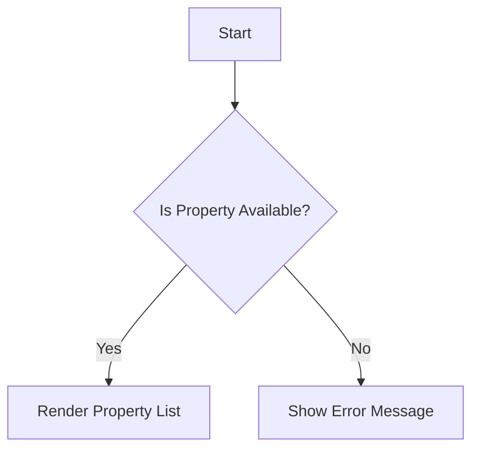
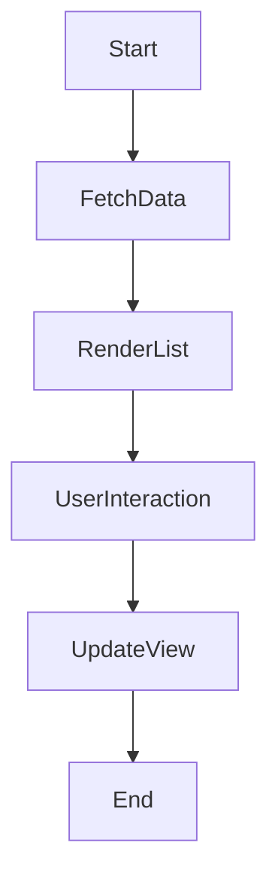

# Github copilot agenda

## Day 1

## Foundations & Mindset Shift

### Vibe Coding Overview & Storytelling

* [Journey with AI Companion](#journey-with-ai-companion)
* [Copilot Chat for New Projects](#copilot-chat-for-new-projects)
* [Copilot Chat Feature](#copilot-chat-feature)

### Developer to Product Thinker Shift

* [New Way of Development](#new-way-of-development)
* [GitHub Copilot and Generative AI](#GitHub-Copilot-and-Generative-AI)
* [GitHub Copilot Coding Agent](#gitHub-copilot-coding-agent)

### Copilot + Prompt Engineering

* [10 Must-Know GitHub Copilot Tips to Save Time in VS Code](#10-must-know-github-copilot-tips-to-save-time-in-vs-code)
* [Unveiling Context Variables in Chat](#unveiling-context-variables-in-chat)
* [GitHub Copilot Hints & Techniques](#github-copilot-hints--techniques)

### Misconceptions in AI-assisted Coding

* [GitHub Copilot Hints & Techniques](#github-copilot-hints--techniques)
* [GitHub Copilot and Generative AI](#github-copilot-and-generative-ai)
* [GitHub Copilot Review Guidelines in VS Code](#github-copilot-review-guidelines-in-vs-code)

### Documentation-First Development

* [GitHub Copilot for Documentation 1](#github-copilot-for-documentation-1)
* [GitHub Copilot for Documentation 2](#github-copilot-for-documentation-2)
* [GitHub Copilot Agent Mode for Auto-Generating Swagger Docs](#github-copilot-agent-mode-for-auto-generating-swagger-docs)


### Slides & Diagrams

* [Turn Diagrams into Code](#turn-diagrams-into-code)
* [GitHub Copilot Mermaid Chart Extension](#github-copilot-mermaid-chart-extension)
* [Generating Software Design Diagrams Using GitHub Copilot](#generating-software-design-diagrams-using-github-copilot)

---

# **Journey with AI Companion**

## **Introduction**

GitHub Copilot is an AI-powered code completion tool developed by GitHub in collaboration with OpenAI. It helps developers write code faster by providing code suggestions directly in your code editor. This guide will walk you through everything you need to know to effectively use GitHub Copilot.

---

## **Prerequisites**

* A GitHub account
* An active GitHub Copilot subscription
* Visual Studio Code (VS Code) installed (or any supported IDE)

---

## **Step 1: Setting Up GitHub Copilot**

1. **Sign in to GitHub**

   * Go to [GitHub.com](https://github.com) and log in.

2. **Activate GitHub Copilot Subscription**

   * Go to your account settings.
   * Under "Billing and plans," ensure that you have an active Copilot subscription.

3. **Install GitHub Copilot Extension in VS Code**

   * Open VS Code.
   * Go to the Extensions tab (Ctrl+Shift+X).
   * Search for "GitHub Copilot" and click "Install."

4. **Sign in to GitHub from VS Code**

   * Click on the GitHub Copilot icon in the lower right.
   * Sign in using your GitHub account.

---

## **Step 2: Basic Usage of GitHub Copilot**

### **Generating Code Suggestions**

* Start typing any code or function name, and Copilot will automatically provide suggestions.
* Use `Tab` to accept the suggestion.

### **Example:**

* Type `def calculate_area` and GitHub Copilot will automatically suggest the full function code:

```python
# Start typing
def calculate_area(radius):
```

**Copilot Suggestion:**


---

## **Step 3: Using Prompts Effectively**

### **Writing Natural Language Prompts**

* GitHub Copilot can understand natural language comments.
* Example:

```python
# Write a function to calculate factorial of a number
```

**Copilot Suggestion:**


```python
def factorial(n):
    if n == 0 or n == 1:
        return 1
    else:
        return n * factorial(n - 1)
```

### **Advanced Prompting**

* Use more descriptive prompts for complex tasks.
* Example:

```python
# Write a Python function that connects to a MongoDB database and retrieves all documents from a collection
```

**Copilot Suggestion:**


```python
from pymongo import MongoClient

def fetch_all_documents():
    client = MongoClient("mongodb://localhost:27017")
    db = client["mydatabase"]
    collection = db["mycollection"]
    return list(collection.find())
```

---

## **Step 4: Leveraging Copilot in Different Programming Languages**

* GitHub Copilot is not limited to Python. You can use it with multiple languages like JavaScript, Java, C++, and more.

### **JavaScript Example:**

```javascript
// Create a function to check if a number is even
```

**Copilot Suggestion:**

```javascript
function isEven(num) {
    return num % 2 === 0;
}
```

---

## **Step 5: Debugging with Copilot**

* If a code snippet is not working, use natural language to guide Copilot.
* Example:

```python
# Fix the following function to handle negative inputs
```

**Copilot will suggest an improved version of the function**


---

## **Step 6: Copilot Configuration and Settings**

* Go to VS Code settings (File > Preferences > Settings).
* Search for "GitHub Copilot."
* You can configure options like:

  * Enabling or disabling Copilot.
  * Setting Copilot to automatically show suggestions or wait for manual triggers.

---

## **Step 7: Best Practices for Using GitHub Copilot**

* Use clear and descriptive comments for better suggestions.
* Regularly review Copilot's code to ensure accuracy.
* Use Copilot's inline suggestions for speed, but always verify the logic.

---

## **Conclusion**

GitHub Copilot can significantly enhance your coding speed and efficiency. By using the right prompts and understanding how Copilot works, you can leverage its full potential.

---

> **Reference video:** https://www.youtube.com/watch?v=cCG9EBlBs14&list=PLIPPtc5KlYDPDBmDjBCDJt-5Zcdq3tG86&index=64

---

# **GitHub Copilot Chat for New Projects**

## **Part 1: Create a Machine Learning Project (Sentiment Analysis) using GitHub Copilot Chat**

**Goal**

Create a Jupyter notebook to perform sentiment analysis on 7 hard-coded statements and visualize the sentiment scores.

---

### **Step-by-Step**

#### **Step 1: Open Visual Studio Code with Copilot Chat**

Make sure you have:

* GitHub Copilot Chat extension installed
* VS Code updated
* Jupyter extension installed

---

#### **Step 2: Prompt Copilot Chat to Create a Sentiment Analysis Notebook**

**Prompt to Copilot Chat:**

> "Create a Jupyter notebook for sentiment analysis of 7 hardcoded statements. Calculate sentiment scores and plot them as a bar chart."

**Copilot Suggestion:**

Copilot will respond with:


* Notebook code including:

  * Library imports
  * List of 7 statements
  * Sentiment analysis using `TextBlob` or `VADER`
  * Score calculation
  * Bar chart plot


---

#### **Step 3: Verify the Notebook**

**Example Snippet:**

**Import libraries**
```python
# Step 1: Import libraries
import pandas as pd
import matplotlib.pyplot as plt
from textblob import TextBlob
```


**Create data**
```python
# Define 7 hardcoded statements
statements = [
    "I love sunny days and blue skies.",
    "This is the worst movie I have ever seen.",
    "The food was okay, nothing special.",
    "I'm so excited about the upcoming concert!",
    "I feel sad when it rains all day.",
    "The customer service was excellent and very helpful.",
    "I'm not sure how I feel about this new policy."
]

# Create a DataFrame
df = pd.DataFrame({'Statement': statements})
df
```

**Ouput**


**Calculate sentiment polarity for each statement**
```python
df['Polarity'] = df['Statement'].apply(lambda x: TextBlob(x).sentiment.polarity)
df
```
**Ouput**


```python
# Plot sentiment scores as a bar chart
plt.figure(figsize=(10, 6))
bars = plt.bar(range(len(df)), df['Polarity'], color='skyblue')
plt.xticks(range(len(df)), [f"Statement {i+1}" for i in range(len(df))], rotation=45)
plt.xlabel('Statements')
plt.ylabel('Sentiment Polarity')
plt.title('Sentiment Analysis of 7 Hardcoded Statements')
plt.ylim(-1, 1)

# Annotate bars with actual statements
for bar, statement in zip(bars, df['Statement']):
    plt.text(bar.get_x() + bar.get_width()/2, bar.get_height(), statement, 
             ha='center', va='bottom', fontsize=8, rotation=90, wrap=True)

plt.tight_layout()
plt.show()
```


**output**


---

#### **Step 4: Customize with a Line Chart**

**Prompt to Copilot Chat:**

> "Replace the bar chart with a line chart for sentiment scores of each statement."

**Copilot Suggestion:**

```python
# Plot sentiment scores as a line chart
plt.figure(figsize=(10, 6))
plt.plot(range(len(df)), df['Polarity'], marker='o', color='skyblue', linewidth=2)
plt.xticks(range(len(df)), [f"Statement {i+1}" for i in range(len(df))], rotation=45)
plt.xlabel('Statements')
plt.ylabel('Sentiment Polarity')
plt.title('Sentiment Analysis of 7 Hardcoded Statements')
plt.ylim(-1, 1)

# Annotate points with actual statements
for i, (x, y, statement) in enumerate(zip(range(len(df)), df['Polarity'], df['Statement'])):
    plt.text(x, y, statement, ha='center', va='bottom', fontsize=8, rotation=90, wrap=True)

plt.tight_layout()
plt.show()
```

**Output**


---

## **Part 2: Build a Java Employee Management Application using GitHub Copilot Chat**

**Goal**

Develop a complete Java-based Employee Management System with:

* Add employee
* Validate email and phone
* Calculate payroll
* Send notifications
* Exception handling and logging

---

### **Step-by-Step**

#### **Step 1: Prompt Copilot to Create Project Structure**

**Prompt:**

> "Create a Java application for employee management. Include methods to add employee, validate email and phone, calculate payroll, and send notifications."

**Copilot Suggestion:**

* Java class named `EmployeeManagement`
* Methods for all requested features
* Standard folder structure (Maven style):

  ```
  src/
    main/
      java/com/example/
    test/
  ```

---

#### **Step 2: Request Project Workspace**

**Prompt:**

> "Create a workspace for this Java application with appropriate file structure and logging support using Log4j."

**Copilot Suggestion:**

* Creates file layout:

  ```
  - src/main/java/com/example/EmployeeManagement.java
  - src/test/java/com/example/EmployeeManagementTest.java
  - resources/log4j2.xml
  ```

---

#### **Step 3: Review the Main Java Class**

**Example Snippet:**

```java
public class EmployeeManagement {

    public void addEmployee(String name, String email, String phone) {
        if (!isValidEmail(email) || !isValidPhone(phone)) {
            System.out.println("Invalid email or phone");
            return;
        }
        // logic to add employee
    }

    public boolean isValidEmail(String email) {
        return email.matches("^[\\w-.]+@([\\w-]+\\.)+[\\w-]{2,4}$");
    }

    public boolean isValidPhone(String phone) {
        return phone.matches("\\d{10}");
    }

    public double calculatePayroll(double hours, double rate) {
        return hours * rate;
    }

    public void sendNotification(String message) {
        System.out.println("Sending notification: " + message);
    }
}
```

---

#### **Step 4: Add Exception Handling**

**Prompt:**

> "Add exception handling to all methods in EmployeeManagement.java."

**Copilot Suggestion:**
Adds `try-catch` blocks:

```java
try {
    // logic
} catch (Exception e) {
    e.printStackTrace();
}
```

---

#### **Step 5: Add Logging Support**

**Prompt:**

> "Add try-catch blocks that log exceptions using Log4j."

**Copilot Suggestion:**

```java
private static final Logger logger = LogManager.getLogger(EmployeeManagement.class);

public void addEmployee(String name, String email, String phone) {
    try {
        if (!isValidEmail(email)) throw new IllegalArgumentException("Invalid Email");
        // logic
    } catch (Exception e) {
        logger.error("Error adding employee", e);
    }
}
```

---

#### **Step 6: Add Unit Tests**

**Prompt:**

> "Generate JUnit test cases for each method in EmployeeManagement class."

**Copilot Suggestion:**
Creates `EmployeeManagementTest.java` with tests like:

```java
@Test
public void testIsValidEmail() {
    EmployeeManagement em = new EmployeeManagement();
    assertTrue(em.isValidEmail("test@example.com"));
}
```

---

## **Conclusion**

**GitHub Copilot Chat can:**

* **Bootstrap new projects** in multiple languages
* **Understand and implement features** based on plain English instructions
* **Quickly iterate** on changes like exception handling, logging, testing
* **Empower non-experts** to create functional ML or Java apps easily

---

# **GitHub Copilot Chat Feature**
Here's a **detailed step-by-step guide** on how to use **GitHub Copilot Chat** effectively—especially tailored for developers working with **Visual Studio Code (VS Code)** or **Visual Studio**. which explores various use cases of Copilot Chat including:

* Code suggestion
* Code explanation
* Code translation
* Security vulnerability detection
* Performance tuning
* Code refactoring
* Unit test generation

---

## **What Is GitHub Copilot Chat?**

**GitHub Copilot Chat** is an AI-powered pair programmer that goes beyond simple code completions. It offers contextual suggestions and allows you to interactively chat with the model to:

* Explain existing code
* Refactor code
* Translate between programming languages
* Identify and fix bugs or vulnerabilities
* Generate unit tests and more

---

## **1. Setup & Installation**

### **Prerequisites:**

* A GitHub Copilot **subscription**
* **Visual Studio Code** or **Visual Studio 2022+**
* Node.js installed (for some extensions)

### **Installation Steps in VS Code:**

1. Open **VS Code**.
2. Go to the **Extensions** tab (`Ctrl+Shift+X`).
3. Search for **"GitHub Copilot"** and install it.
4. Search for **"GitHub Copilot Chat"** and install it too.

   > 💡 *This is in preview mode. You need to join the Copilot Chat technical preview ([https://github.com/features/preview/copilot-chat](https://github.com/features/preview/copilot-chat)) if not enabled by default.*

5. **Sign in** with your GitHub account and authorize access.
6. Once installed, you'll see a **Copilot Chat icon** in the sidebar.

---

## **2. Using Copilot Chat: Features in Detail**

**Example:**
> Ask Copilot to write code from a high-level instruction.

```text
# Define a BlobManager class for uploading and downloading files to Azure Blob Storage
```

**Code Suggestion**

* Copilot generates a complete class with proper NuGet dependencies, constructor, and methods.
* You can click the clipboard or code icons to insert suggestions directly into your editor.

---

### **Code Explanation**

> Useful when working with unfamiliar or legacy code.

**How:**

* Select a code snippet
* Use prompt: `/explain` or type:

```text
"Explain what this code does"
```

**Code Suggestion**

* Identify the programming language
* Provide line-by-line or functional summaries
* Clarify the purpose of each component

---

### **Code Translation**

> Translate between different programming languages.

**Example Prompts:**

* "Translate this C# class to Python"
* "Convert the following COBOL code to C#"

**Copilot Suggestion:**

* Automatically identifies code blocks
* Translates to the requested language
* Explains the translated logic

---

### **Security Vulnerability Detection**

> Identify common vulnerabilities like SQL injection or XSS.

**Example:**

1. Select insecure code:

```csharp
string query = "SELECT * FROM users WHERE name = '" + userName + "'";
```

2. Prompt:

```text
"What are the security concerns in this code?"
```

**Copilot suggestion:**

* Detect issues (e.g., SQL Injection)
* Explain the vulnerability
* Suggest mitigation (e.g., use of parameterized queries)

---

### **Performance Optimization**

> Detect inefficient patterns like string concatenation in loops.

**Example:**

```csharp
string result = "";
for (int i = 0; i < 5000; i++) {
    result += i.ToString();
}
```

**Prompt:**

```text
"Is there a performance issue in this code?"
```

**Copilot Suggestion**

* Highlights the issue (string immutability)
* Recommends using `StringBuilder` for optimization
* Provides an updated code snippet

---

### **Code Refactoring**

> Improve readability, maintainability, and modularity.

**Example Prompt:**

```text
"Refactor this method into multiple smaller methods"
```

**Copilot Suggestion:**

* Detect logical segments in code
* Break them into reusable methods
* Maintain functional linkage between them

**Another example:**

```text
"Refactor nested if-else statements into a switch statement"
```

---

### **Unit Test Generation**

> Generate tests for existing functions.

**Prompt:**

```text
"Write unit tests for this method using xUnit (or NUnit)"
```

**Copilot Suggestion**

* Generates setup code
* Creates test cases for different branches
* Suggests mocking strategies if needed

---

## **Common Copilot Chat Slash Commands**

These can be entered in the chat box:

| Command      | Description                           |
| ------------ | ------------------------------------- |
| `/explain`   | Explains the selected code            |
| `/fix`       | Suggests bug fixes                    |
| `/test`      | Generates unit tests                  |
| `/security`  | Detects security flaws                |
| `/translate` | Translates code into another language |
| `/optimize`  | Improves performance                  |
| `/refactor`  | Suggests code refactoring             |

---

## **Tips for Best Results**

* **Be specific in prompts.** Instead of “fix this,” try “fix SQL injection vulnerability.”
* **Select only relevant code** before asking questions.
* **Iterate with Copilot.** If the first suggestion isn't perfect, refine your prompt.
* **Validate suggestions.** Copilot helps but isn’t infallible—always review generated code.

---

## **Sample Use Case Flow**

Imagine you're building a backend API in C#:

1. Ask Copilot to **generate a service class**.
2. Use it to **explain third-party code** you integrated.
3. Translate the API class into **Python** for your data science team.
4. Ask it to **detect vulnerabilities** in your SQL logic.
5. Get help to **optimize performance bottlenecks** in loops.
6. Refactor large classes into **clean, modular methods**.
7. Generate **unit tests** with mocks using your testing framework.

---

## **Conclusion**

GitHub Copilot Chat isn't just an autocomplete tool - it's your **interactive AI pair programmer** that can:

* Understand your intent
* Work across languages and frameworks
* Guide you through design, testing, and security

---

> **Reference video:** https://www.youtube.com/watch?v=QptWTiFLUOE&list=PLIPPtc5KlYDPDBmDjBCDJt-5Zcdq3tG86&index=100

---
# **New Way of Development**

## **Introduction**

GitHub Copilot Workspace is a revolutionary feature designed to transform how developers write code. It extends GitHub Copilot's capabilities, allowing you to turn natural language ideas into fully functional code and complete software applications.

### **What is GitHub Copilot Workspace?**

GitHub Copilot Workspace is an extension of GitHub Copilot, providing a specialized environment where you can:

* Convert natural language descriptions directly into code.
* Automatically generate complete code components, services, and modules.
* Easily modify, update, and enhance generated code.
* Directly manage code files, branches, and pull requests.

### **Key Features**

* **Natural Language to Code:** Describe your requirements in plain English, and GitHub Copilot Workspace generates the code.
* **Context-Aware Understanding:** Analyzes your existing codebase to understand your application's structure.
* **Interactive Planning and Specification:** Automatically generates a detailed code plan, which you can review, modify, and enhance.
* **Automated Code Generation:** Generates all necessary code files, services, components, and configurations.
* **Branch Management:** Automatically creates branches, generates pull requests, and allows you to review and merge changes.

---

## **How to Access GitHub Copilot Workspace**

1. **Prerequisites:**

   * A GitHub account with access to GitHub Copilot (subscription required).
   * Access to the GitHub Copilot Workspace preview (sign up through the GitHub blog).

2. **Starting GitHub Copilot Workspace:**

   * Open any GitHub repository.
   * Locate the "Copilot Workspace" option in the interface.
   * Click "Start Workspace" to begin.

---

## **Detailed Step-by-Step Guide with Examples**

### **Step 1: Describe Your Requirement**

1. Navigate to your project repository.
2. Click "Copilot Workspace" and start a new workspace.
3. Enter your requirement in natural language. Example:

   * "Add a new component for uploading new pet details to my Pet Shop application."

### **Example Prompt:**

"Add a new Angular component called 'UploadPet' that allows users to enter pet details, including name, category, image URL, and description."

### **Step 2: Review the Initial Analysis**

1. Copilot Workspace will analyze your project and identify existing components.
2. It will list the components that already exist (like header, footer, etc.).
3. It will suggest a proposed solution. Example:

   * "A new component called `UploadPetComponent` should be created."

### **Step 3: Modify the Specification**

1. Review the generated specifications.
2. Add any additional requirements. Example:

   * "Update README file with the new feature."
   * "Add custom styles for the new component."

### **Step 4: Generate the Code Plan**

1. Click "Generate Plan."
2. GitHub Copilot Workspace will create a detailed plan, file by file.
3. Review the plan. Example:

   * Add `UploadPetComponent` with form fields: name, category, image URL, description.
   * Update `AppModule` to include this new component.
   * Create a service `UploadPetService` to handle the API requests.

### **Copilot Suggestion Example:**

"Would you like to add form validation for pet details?"

### **Step 5: Generate the Code**

1. Click "Implement Selected Files."
2. Copilot will generate the required files:

   * HTML file with a form.
   * TS file with form logic and API calls.
   * CSS file for custom styles.
3. Review the generated code and make any adjustments if needed.

### **Copilot Suggestion Example:**

"Would you like to add a success message after uploading the pet details?"

### **Step 6: Create a Pull Request**

1. Review all the generated files and the changes.
2. Choose to create a new branch or push directly to the main branch.
3. Provide a description for the pull request.
4. Review the PR and merge it once tested.

---

## **Advanced Tips and Tricks**

* Use clear and detailed natural language descriptions for better code generation.
* Review the generated specifications and enhance them as needed.
* Use the "Revise" option to correct any mistakes or improve generated code.
* Regularly test the generated code to ensure it meets your requirements.

---

## **Practical Examples and Scenarios**

### **Scenario 1: Building a Login Component**

* Prompt: "Add a LoginComponent with email and password fields, along with a login button."
* Copilot generates the HTML, TS, and CSS files.
* Review and modify as needed.

### **Scenario 2: Creating a Dashboard**

* Prompt: "Create a DashboardComponent that displays user statistics and recent activity."
* Copilot generates a complete dashboard layout.

---

## **Conclusion**

GitHub Copilot Workspace is a powerful tool that can transform your development workflow. Whether you are building a new feature or making improvements, this tool can save you significant time while maintaining code quality.

---

> **Referece video:** https://www.youtube.com/watch?v=W323mTVhsA4&list=PLIPPtc5KlYDPDBmDjBCDJt-5Zcdq3tG86&index=65

---


# **GitHub Copilot and Generative AI**

## **Introduction**

GitHub Copilot and other generative AI tools are transforming how developers write, debug, and optimize code. This guide provides a detailed, step-by-step walkthrough of how these tools enhance the developer workflow, boost productivity, and foster innovation.

---

## **1. Understanding GitHub Copilot and Generative AI**

* **What is GitHub Copilot?**

  * A code completion tool powered by OpenAI’s Codex model.
  * Assists developers in writing code by providing real-time code suggestions.

* **What is Generative AI?**

  * A type of AI that can generate text, code, images, and more.
  * Uses large-scale neural networks to understand and generate complex content.

---

## **2. Setting Up GitHub Copilot**

* **Prerequisites:**

  * A GitHub account (Free or Pro).
  * A compatible IDE (VS Code, JetBrains, GitHub Codespaces).

* **Step-by-Step Setup:**

  1. Go to the GitHub Copilot page on GitHub.
  2. Enable GitHub Copilot for your account.
  3. Install the GitHub Copilot extension in your IDE.
  4. Log in with your GitHub credentials.

---

## **3. How GitHub Copilot Works**

* **Contextual Code Suggestions:**

  * Copilot analyzes your code context and provides inline suggestions.
  * Supports multiple languages (Python, JavaScript, TypeScript, Java, etc.).

* **Multi-Line Completions:**

  * Offers complete function implementations based on the code comments or function signatures.

* **Comment-Based Commands:**

  * Developers can use comments to describe the desired functionality, and Copilot will generate the code.

---

## **4. Practical Use Cases of GitHub Copilot**

* **1. Code Completion:**

  * Automatically completes lines of code.

* **2. Code Refactoring:**

  * Recommends optimized versions of existing code.

* **3. Code Documentation:**

  * Generates docstrings for functions and classes.

* **4. Error Fixing:**

  * Identifies and suggests fixes for code errors.

---

## **5. Advanced Usage: Customizing Copilot**

* **Personalized Suggestions:**

  * GitHub Copilot can learn from your code style and provide more personalized suggestions.

* **Configuring Copilot Settings:**

  * Adjust Copilot’s behavior in the IDE settings (enable/disable, change suggestion frequency).

---

## **6. Exploring Other Generative AI Tools**

* **GitHub Codespaces with Copilot:**

  * A cloud-based IDE with built-in Copilot support.

* **Copilot Chat (Preview Feature):**

  * A conversational AI assistant integrated into the IDE for code explanations and debugging.

---

## **7. The Future of Developer Ecosystem with Generative AI**

* Enhanced developer productivity.
* Automated code generation and optimization.
* Natural language code interaction (Copilot Chat).

---

## **Conclusion**

GitHub Copilot and generative AI are revolutionizing the developer ecosystem by enhancing code generation, improving efficiency, and enabling faster problem-solving. This guide provides a foundational understanding for developers to leverage these tools effectively.

---

# **GitHub Copilot Coding Agent**

This guide will help you **get started** with the GitHub Copilot Coding Agent, showing you how to assign tasks, review PRs, and iterate with Copilot as your AI teammate.

---

## **What is Copilot Coding Agent?**

The **Copilot Coding Agent** is an AI-powered teammate that:
- Takes issues or tasks from your repo.
- Implements changes (code, docs, tests).
- Raises Pull Requests (PRs).
- Responds to PR review comments and feedback.
- Revises code as requested.

It works from **natural language instructions** and is available for **Copilot Enterprise** and **Copilot Pro+** users.

---

## **Prerequisites**

- **GitHub Copilot Enterprise** or **Copilot Pro+** subscription.
- Repository hosted on **GitHub.com**.
- Permissions to create issues and review PRs.
- (Recommended) Branch protection rules enabled.

---

## **How It Works**

1. **Create an Issue**: Describe your task in plain English.
2. **Assign to Copilot Agent**: Assign the issue to the Copilot Agent bot.
3. **Copilot Plans & Implements**: Copilot analyzes, plans, and makes changes.
4. **PR Creation**: Copilot opens a draft PR with the changes.
5. **Review & Feedback**: You review, comment, or request changes.
6. **Copilot Revises**: Copilot updates the PR as per your feedback.
7. **Merge**: You merge the PR when satisfied.

---

## **Step-by-Step Example Workflow**

### **1. Create an Issue**

**Prompt Example:**
```
Title: Update README with Contributor and License sections

Body:
Please update the README file to include:
- A "Contributors" section listing all contributors.
- A "License" section with MIT License details.
```

### **2. Assign the Issue to Copilot Agent**

- Assign the issue to `@github-copilot-agent` (or the Copilot bot for your org).

### **3. Copilot Plans & Implements**

**What Copilot Does:**
- Reads your repo and current README.
- Checks for existing LICENSE or CONTRIBUTORS files.
- Plans the steps (e.g., add sections, avoid duplication).
- Updates the README as requested.

**Copilot Suggestion Example:**
> "I will add a Contributors section and a License section to the README. If a LICENSE file exists, I will link to it."

### **4. Copilot Opens a Draft PR**

- PR is created in **draft mode** (prevents triggering workflows).
- PR links to the original issue and includes a summary of changes.

**PR Example:**
```
Files changed:
- README.md: Added Contributors and License sections.
```

### **5. Review & Request Changes**

- Review the PR.
- If you want changes, comment on the PR.

**Prompt Example:**
```
Please move the License section into a separate LICENSE file and link to it from the README.
```

### **6. Copilot Revises**

- Copilot reads your feedback.
- Creates a LICENSE file with MIT License.
- Updates README to link to LICENSE file.
- Updates the PR with new commits.

**Copilot Suggestion Example:**
> "Created LICENSE file with MIT License. Updated README to link to LICENSE."

### **7. Merge the PR**

- Once satisfied, approve and merge the PR.

---

## **Usage Cost**

- **GitHub Actions minutes**: Used for automation.
- **Premium requests**: Counted against your Copilot quota (from June 4, 2025).

---

## **Risks & Mitigations**

| Risk                    | Mitigation                                   |
|-------------------------|----------------------------------------------|
| Unwanted code push      | Use branch protection rules                  |
| Code exposure           | Restrict agent’s internet access via firewall|
| Prompt injection        | GitHub sanitizes user input                  |

---

## **Limitations**

- Works only in the repository where the issue exists.
- Only one PR at a time per repo.
- Cannot work on existing PRs (must start from issues).
- Branches from `main` only.
- No commit signing.
- No support for self-hosted runners.
- Content exclusion not honored (agent sees all files).

---

## **Best Practices**

- **Write clear, actionable issues.**
- **Review all PRs** from Copilot before merging.
- **Use branch protection** to control merges.
- **Label issues** for better organization.
- **Monitor usage costs** if running many tasks.

---

## **Summary**

The **GitHub Copilot Coding Agent** automates routine coding tasks, creates PRs, and responds to feedback - acting as an AI teammate. Use it to streamline development, but always review its output for quality and security.

---

# **10 Must-Know GitHub Copilot Tips to Save Time in VS Code**

## **Introduction**

Welcome back to Tech Drill, your ultimate source for GitHub and GitHub Copilot insights! In today’s video, we'll unlock **10 time-saving tips for GitHub Copilot in VS Code** that every developer needs to know. These tips will boost your productivity, streamline your workflow, and make you a GitHub Copilot pro.

## **Prerequisites**

* A GitHub account (free account is sufficient).
* Installed Visual Studio Code (VS Code) or any JetBrains IDE (e.g., IntelliJ, PyCharm).
* Stable internet connection.

---

## **Step 1: Understanding GitHub Copilot Free Tier**

* GitHub Copilot Free Tier provides the following:

  * 2,000 code completions per month.
  * 60 chat requests per month.
  * Access to two models: `Claude` and `GPT-4`.

* Limitations of Free Tier:

  * No unlimited code completions or chat requests.
  * Only accessible in VS Code and JetBrains IDEs.

---

## **Step 2: Setting Up GitHub Copilot in VS Code**

### **1. Installing GitHub Copilot Extension**

1. Open VS Code.
2. Go to the Extensions tab (left sidebar).
3. Search for "GitHub Copilot".
4. Click "Install" to add the extension.

### **2. Signing In with GitHub Account**

1. After installation, click "Sign In" in the Copilot sidebar.
2. Use your GitHub account (ensure you are using a free account for free tier access).
3. Authorize GitHub Copilot in the VS Code prompt.

### **3. Verifying Free Tier Activation**

1. Go to `GitHub.com` → `Settings` → `Copilot`.
2. Ensure that "GitHub Copilot Free" is enabled.
3. You will see your usage limits (2,000 code completions and 60 chat requests per month).

---

## **Step 3: 10 Time-Saving Tips for GitHub Copilot (with Examples)**

### **Tip 1: Drag Files to Copilot Chat**
* Drag files directly from your editor or source tree into Copilot chat.
* Example usage:
```prompt
drag main.js into chat

"Explain the authentication logic in this file"
```

Copilot suggestion: 
*provides detailed explanation of auth logic*


### **Tip 2: Add Context with Folders**
* Example folder structure:
```
src/
  ├── auth/
  │   ├── login.js
  │   └── validation.js
  └── utils/
      └── helpers.js
```
* Drag the entire `auth` folder for authentication-related queries

### **Tip 3: Apply Changes Directly in Editor**
* Example scenario:
```javascript
// Before
function calculateTotal(items) {
    // TODO: Implement calculation
}

// After using "Apply in Editor"
function calculateTotal(items) {
    return items.reduce((sum, item) => sum + item.price * item.quantity, 0);
}
```

### **Tip 4: Edit with Copilot**
* Example command:
```plaintext
You: "Convert all console.log statements to use Winston logger"
Copilot: *Shows preview of changes across multiple files*
```

### **Tip 5: Multi-Edit Overlay**
* Example view:
```diff
File: user.service.js
- console.log('User created:', user);
+ logger.info('User created:', { userId: user.id });

File: auth.service.js
- console.log('Login attempt:', email);
+ logger.info('Login attempt:', { email });
```

### **Tip 6: Add Relevant Files**
* Example suggestion:
```plaintext
Copilot: "I notice you're working on authentication. 
Would you like to include these related files?
- auth.middleware.js
- jwt.config.js
- user.model.js"
```

### **Tip 7: Customize Commit Messages**
* Settings example:
````json
{
    "github.copilot.chat.commitMessageTemplate": "feat(${scope}): ${description}\n\n${body}"
}
````

### **Tip 8: Enable Copilot for Unknown Extensions**

* Allow Copilot to work with any file type by enabling "Plain Text" support.

### **Tip 9: Add Coding Tips**

* Create a `copilot_instructions.md` file to set coding standards.

### **Tip 10: Generate Test Configuration**

* Use "Setup Test" to automatically generate test configurations for your project.

```javascript
// Original code
function validateEmail(email) {
    return /^[^\s@]+@[^\s@]+\.[^\s@]+$/.test(email);
}

// Generated test configuration
describe('Email Validation', () => {
    test('should validate correct email format', () => {
        expect(validateEmail('test@example.com')).toBeTruthy();
        expect(validateEmail('invalid.email')).toBeFalsy();
    });
});
```

---
> **Reference video:** https://www.youtube.com/watch?v=vA7MtzaDHfI&list=PLIPPtc5KlYDPDBmDjBCDJt-5Zcdq3tG86&index=44 

---

# **Unveiling Context Variables in Chat**

## **Overview: What Are Context Variables in GitHub Copilot Chat?**
Context variables let GitHub Copilot Chat understand **where in your code editor, file system, or terminal** you’re focusing, so it can give **contextual answers or generate content**.

Context variables begin with a **`#` (hash symbol)** and work **inside GitHub Copilot Chat**.

---

## **Pre-requisites**

* Install **Visual Studio Code**
* Install the **GitHub Copilot extension**
* Ensure you're **signed in with GitHub**
* Open a **project folder** (not just a single file)
* Enable **GitHub Copilot Chat** from the sidebar or with `Cmd/Ctrl + I`

---

## **Available Context Variables**

| Context Variable        | Description                                             |
| ----------------------- | ------------------------------------------------------- |
| `#editor`               | Refers to the code in the currently open editor tab     |
| `#file`                 | Allows access to any file in your workspace             |
| `#selection`            | Refers to currently selected code in the editor         |
| `#terminal`             | Refers to your VS Code terminal                         |
| `#terminal.lastCommand` | Refers to the **last command** executed in the terminal |
| `#terminal.selection`   | Refers to **selected output** in the terminal           |

---

## **Step-by-Step Guide with Examples**


### **Step 1: Using `#editor` – Understand the Current File**

**Scenario**: You have a file `verifier.cs` open with some class methods.
**File: `verifier.cs`**

```csharp
public class Verifier {
    public bool IsPalindrome(string input) {
        string reversed = new string(input.Reverse().ToArray());
        return input == reversed;
    }

    public bool IsPrime(int number) {
        if (number <= 1) return false;
        for (int i = 2; i < number; i++) {
            if (number % i == 0) return false;
        }
        return true;
    }
}
```

**Prompt:**

```
Explain the methods in #editor
```

**Copilot Chat Response**:
It will analyze all visible methods like:

```csharp
public bool IsPalindrome(string input) { ... }
public bool IsPrime(int number) { ... }
```

It gives descriptions for each function.

---

### **Step 2: Using `#file` – Load & Analyze Any File in Your Project**

**Scenario**: You want to analyze a file not currently open.
**File: `utilities.cs`**

```csharp
public static class Utilities {
    public static string FormatName(string first, string last) {
        return $"{last}, {first}";
    }

    public static int ParseAge(string input) {
        return int.TryParse(input, out var age) ? age : 0;
    }
}
```

**Prompt:**

```
Explain the methods in #file
```

This will trigger a **file picker** – select any file like `utilities.cs`.

Copilot will open that file virtually and summarize the contents, e.g.,:

* Two static methods
* Utility class for formatting or parsing

---

### 🔹 Step 3: Using `#file` for Specific Files**

**File: `environment.ts`**

```ts
export const environment = {
  production: false,
  apiUrl: 'http://localhost:3000/api'
};
```

**Prompt**:

```
What's the use of #file
```

**Example: If you choose `environment.ts`, Copilot might respond:**

> It's an Angular configuration file for storing environment-specific variables.

---

### 🔹 Step 4: Using `#terminal.lastCommand` – Understand the Last Command

**Scenario**: You ran a command like `dotnet build`.

**Prompt:**

```
Explain #terminal.lastCommand
```

**Copilot will respond:**

> The last command `dotnet build` was used to compile your project.
> It will also explain the build output: warnings, errors, etc.

---

### 🔹 Step 5: Using `#terminal.selection` – Explain a Terminal Output Section

**Scenario**: You've selected part of a terminal error message.

**Prompt:**

```
Explain #terminal.selection
```

**Copilot will:**

* Read the selected text
* Explain the error
* Provide potential fixes

---

### **Step 6: Using `#selection` – Work with Selected Code**

**Scenario**: You highlight this code:

```csharp
public bool IsPrime(int number) {
  ...
}
```

**Prompt:**

```
Create unit test for #selection
```

**Copilot generates test cases like:**

```csharp
[TestMethod]
public void TestIsPrime() {
  Assert.IsTrue(obj.IsPrime(7));
  Assert.IsFalse(obj.IsPrime(9));
}
```

---

## **Other Useful Prompts with Context Variables**

| Use Case                | Prompt Example                        |
| ----------------------- | ------------------------------------- |
| Summarize selected code | `Summarize #selection`                |
| Translate selected code | `Translate #selection to Python`      |
| Refactor selected code  | `Refactor #selection for readability` |
| Explain purpose of file | `What is the purpose of #file`        |
| Fix errors in terminal  | `Fix #terminal.selection`             |
| Add comments to code    | `Add comments to #editor`             |
| List todos in file      | `Find all TODOs in #editor`           |

---

## **Tips & Best Practices**

* Use **context variables instead of copying code** manually.
* Combine context + command, e.g.:

  * `Summarize #file`
  * `Generate unit tests for #editor`
* Select minimal required code when using `#selection`.
* Chain prompts: Ask for unit test → ask for mocking → ask for refactor.

---

## **Summary**

| Context Variable        | Usage Example                     |
| ----------------------- | --------------------------------- |
| `#editor`               | `Explain the methods in #editor`  |
| `#file`                 | `Explain the purpose of #file`    |
| `#selection`            | `Create unit test for #selection` |
| `#terminal.lastCommand` | `Explain #terminal.lastCommand`   |
| `#terminal.selection`   | `Fix #terminal.selection`         |

These features help you **supercharge development** using **Copilot Chat** without leaving your flow.

---
> **Reference video:** https://www.youtube.com/watch?v=hJIg8lGtIRU&list=PLIPPtc5KlYDPDBmDjBCDJt-5Zcdq3tG86&index=76

---

# **GitHub Copilot Hints & Techniques**

Here's a **step-by-step guide** for using GitHub Copilot to fix compile errors, get code explanations, and use inline chat—just like in the demo you provided. This guide includes **examples, prompts, Copilot suggestions, and file inputs** for hands-on practice.

---

## **Prerequisites**

* Install **GitHub Copilot extension** in **VS Code** or **IntelliJ**.
* Ensure you're signed in with a GitHub account that has Copilot enabled.
* Use a project in **C#**, **Python**, or **JavaScript** for best results.

---

## **Part 1: Fixing Compile Errors with GitHub Copilot**

### **Example: C# Console App with Error**

**File: `Program.cs`**

```csharp
using System;

class Program
{
    static void Main(string[] args)
    {
        string[] lines = File.ReadAllLines("data.txt");
        Console.WriteLine(lines);
    }
}
```

### **Problem:**

* You're missing a `using System.IO;` directive.
* `Console.WriteLine(lines);` should loop through the array.

### **Steps:**

1. **Run `dotnet build` in terminal.**

   ```bash
   dotnet build
   ```

2. **Right-click on error in terminal > `GitHub Copilot: Explain this error`.**

3. **Copilot Suggestion:**

   * Suggests: `using System.IO;`
   * Suggests looping with `foreach`

4. **Fix:**

```csharp
using System;
using System.IO;

class Program
{
    static void Main(string[] args)
    {
        string[] lines = File.ReadAllLines("data.txt");
        foreach (var line in lines)
        {
            Console.WriteLine(line);
        }
    }
}
```

---

## **Part 2: Using Copilot to Explain Concerns in Code**

### **Example: Python Script with Issues**

**File: `demo.py`**

```python
scores = [10, 20, 30]
print(scor)
```

### **Problem:**

* Typo: `scor` should be `scores`.

### **Steps:**

1. Hover over the red squiggle (`scor`).
2. Press `Cmd+.` or `Ctrl+.` → Select `Explain with Copilot`.

### **Copilot Suggestion:**

* "NameError: name 'scor' is not defined. Did you mean 'scores'?"


---

## **Part 3: Using Inline Chat for Feature Requests**

### **Example Prompt in Inline Chat**

Open any file and press:

* `Cmd+I` (Mac) or `Ctrl+I` (Windows) to trigger Copilot Chat (or use sidebar).

### **Prompt:**

```plaintext
Define a method to check if a number is prime. Define main to invoke it.
```

### **Copilot Suggestion:**

```python
def is_prime(n):
    if n < 2:
        return False
    for i in range(2, int(n**0.5) + 1):
        if n % i == 0:
            return False
    return True

def main():
    number = 13
    if is_prime(number):
        print(f"{number} is a prime number")
    else:
        print(f"{number} is not a prime number")

main()
```

---

## **Extend Code with New Prompts**

### **Prompt:**

```plaintext
Add functionality to check if the number is even or odd before checking for prime.
```

### **Copilot Suggestion:**

```python
def is_even(n):
    return n % 2 == 0

def main():
    number = 13
    if is_even(number):
        print(f"{number} is even")
    else:
        print(f"{number} is odd")

    if is_prime(number):
        print(f"{number} is a prime number")
    else:
        print(f"{number} is not a prime number")
```

---

## **Sample File Structure**

```
copilot-demo/
├── Program.cs       # For C# compile error demo
├── demo.py          # For Python explanation + inline chat
├── data.txt         # Dummy text file for ReadAllLines()
```

---

## **Summary**

| Feature                  | Prompt/Action                                | Output                            |
| ------------------------ | -------------------------------------------- | --------------------------------- |
| Fix Compile Error        | Right-click on error > Copilot: Explain this | Suggest fixes, imports, syntax    |
| Explain Code Concern     | Hover > Cmd+. > Explain with Copilot         | Get detailed reasoning            |
| Inline Chat Suggestions  | Cmd+I (Mac) or Ctrl+I > Prompt               | Generate methods, fix logic       |
| Extend Feature Prompting | “Add X functionality”                        | Copilot generates code in context |

---
> **Reference video:** https://www.youtube.com/watch?v=-YCzDBBAX7w&list=PLIPPtc5KlYDPDBmDjBCDJt-5Zcdq3tG86&index=94

---


# **GitHub Copilot Review Guidelines in VS Code**

## **Step 1: Install GitHub Copilot Extension in VS Code**

1. **Open VS Code:** Launch your Visual Studio Code application.
2. **Go to Extensions:** Click on the Extensions icon on the left sidebar.
3. **Search for GitHub Copilot:** Type "GitHub Copilot" in the search bar.
4. **Install the Extension:** Click the "Install" button to add GitHub Copilot to your VS Code.

---

## **Step 2: Access GitHub Copilot Settings**

**1. Open Settings:** Go to `File > Preferences > Settings` or use the shortcut (`Ctrl + ,`).
**2. Search for Copilot Settings:** Type "GitHub Copilot" in the search bar.
**3. Open Copilot Settings:** You will see multiple settings for GitHub Copilot. Locate **"GitHub Copilot Chat Review Instructions"**.

---

## **Step 3: Set Up Review Guidelines**

* **Locate Review Settings:**

   * Go to **"GitHub Copilot Chat Review Selection Instructions."**
   * This is where you will define review guidelines for code.

* **Add Review Instructions:**

   * You can directly enter text instructions for Copilot to follow when reviewing code.
   * Example Review Instructions:

     * For **C# Code:**

       * Use **underscore `_`** for field names.
       * Use **XML documentation comments** for all public methods.
     * For **Python Code:**

       * Use **snake\_case** for function names.
       * Use **docstrings** for documentation.

* **Sample Settings Configuration:**

   ```plaintext
   - For C# code, use underscore for field names.
   - Use XML documentation for all public methods.
   - For Python code, use snake_case for function names.
   - Use docstrings for Python method documentation.
   ```
  

---

## **Step 4: Review Code with GitHub Copilot in VS Code**

* **Open a Code File:** Open any C# or Python file you want to review.
  

* **Select Code for Review:** Highlight the code segment you want Copilot to review.
  
* **Right-Click and Choose Review:**

   * Right-click the selected code.
   * Select **"Copilot: Review and Comment"**.
     

* **Review Suggestions:**
  

   * GitHub Copilot will analyze the code and provide review comments based on the instructions you set.
   * It can suggest:

     * Correcting naming conventions (snake\_case, underscore).
     * Adding missing documentation (XML for C#, docstring for Python).
     * Improving code structure.

---

## **Step 5: Apply or Discard Copilot Suggestions**

* **Review Each Suggestion:**
  

   * You can either **Accept, Modify, or Discard** each suggestion.
   
   
   * If a suggestion is helpful, click **"Accept"**.
   * If not, click **"Discard"**.

* **Multiple Suggestions Handling:**
   * If Copilot provides multiple suggestions, you can choose to apply them one by one or discard all.
     
---

## **Step 6: Customize Review Guidelines as Needed**

* **Refine Instructions:**

   * If the review instructions do not align with your expectations, return to the settings.
   * Add or modify the instructions based on your coding standards.

* **Advanced Settings:**

   * You can specify different instructions for different languages.
   * Example:

     * For **JavaScript:** Use camelCase for variable names.
     * For **Java:** Use PascalCase for class names.

---

## **Step 7: Review Python Code with Copilot**

* **Select Python Code:** Highlight a Python function or class.
* **Right-Click and Select "Review and Comment."**
* **Observe Suggestions:**

   * Function names should follow snake\_case.
   * Missing docstrings will be suggested.
   * Variable names can be optimized.

---

## **Step 8: Review C# Code with Copilot**

* **Select C# Code:** Highlight a C# method or class.
* **Right-Click and Select "Review and Comment."**
* **Observe Suggestions:**

   * Field names should use an underscore `_`.
   * Missing XML documentation will be suggested for public methods.
   * Inconsistent naming will be corrected.

---

## **Step 9: Save and Manage Your Review Settings**

* **Save Settings:** Ensure you save any changes you make in the GitHub Copilot settings.
* **Backup Settings:** Consider copying your review guidelines to a separate file for backup.

---

## **Step 10: Explore Advanced Review Scenarios**

* **Try Reviewing Commit Changes:**

   * In the Source Control panel, right-click a commit and select **"Review with Copilot."**
* **Review Multiple Files:**

   * You can also select multiple files or a folder and perform a bulk review.

---

## **Tips and Best Practices**

* Keep review guidelines consistent with your team’s coding standards.
* Regularly update the guidelines to match evolving best practices.
* Use clear and specific instructions for better Copilot review performance.
* Test your settings with different languages (Python, C#, JavaScript) to ensure they work as expected.

---
> **Reference video:** https://www.youtube.com/watch?v=tL0gppE1Zc0&list=PLIPPtc5KlYDPDBmDjBCDJt-5Zcdq3tG86&index=33

---


# **GitHub Copilot for Documentation 1**

## **Introduction**
GitHub Copilot is an AI-powered code assistant developed by GitHub, designed to help developers write code faster and more efficiently. In addition to code generation, Copilot is highly effective for creating detailed documentation directly within your codebase. This guide will take you through the various ways you can leverage GitHub Copilot to automate and enhance your code documentation process.

---

## **1. Setting Up GitHub Copilot in VS Code**
1. Ensure you have VS Code installed.
2. Install the GitHub Copilot extension from the VS Code marketplace.
3. Sign in using your GitHub account and ensure Copilot is activated.

---

## **2. Understanding the Importance of Documentation**
* Documentation makes code more readable and maintainable.
* It helps other developers understand the code's functionality without delving into its logic.
* It is crucial for API documentation, code readability, and external integration.

---

## **3. Using GitHub Copilot for Code Documentation**

### **3.1 Method/Function Documentation**

* **Step 1:** Write your code or identify the method/function you want to document.
* **Step 2:** Place your cursor above the method.
* **Step 3:** Use the prompt:

  ```plaintext
  Add documentation to this method.
  ```
* **Example:**

  ```python
  def calculate_area(radius):
      return 3.14 * radius * radius
  ```

  **After prompting Copilot, it generates:**
  

### **3.2 In-Line Code Comments**

* **Step 1:** Identify a complex block of code.
* **Step 2:** Use the prompt:

  ```plaintext
  Add code comments.
  ```
* **Example:**

  ```python
  def calculate_discount(price, discount):
      return price - (price * discount / 100)
  ```

  **After prompting Copilot, it generates:**

  

---

## **4. API Documentation with GitHub Copilot**

### **4.1 Documenting API Methods**

* **Step 1:** Create or open an API controller file (e.g., `api_controller.py`).
* **Step 2:** Use the prompt:

  ```plaintext
  Add API documentation for all methods.
  ```
* **Example:**

  ```python
  @app.get("/user/{user_id}")
  def get_user(user_id: int):
      # Fetch user details by ID
      pass
  ```

  **After prompting Copilot, it generates:**

  

### **4.2 External API Documentation**

* **Step 1:** Identify your API file (e.g., `api_controller.py`).
* **Step 2:** Use the prompt:

  ```plaintext
  Generate external API documentation for this file.
  ```
* **Example:**

  ```plaintext
  API Name: User Management API
  Endpoint: GET /user/{user_id}
  Description: Retrieves user details by ID.
  Parameters:
  - user_id (int): The ID of the user.
  Response:
  - 200: User details.
  - 404: User not found.
  ```

* **Copilot Suggestion**
  

---

## **5. Documenting Complex Code Structures**

* **Step 1:** Identify a complex code file (e.g., a Cloud Resource Template).
* **Step 2:** Use the prompt:

  ```plaintext
  Summarize the resources used in this file.
  ```
* **Example:**

  ```plaintext
  - Resource: SQL Server
  - Resource: Firewall Rules
  - Resource: Auto Scale Settings
  ```

* **Copilot suggestion**
  

---

## **6. Best Practices for Using GitHub Copilot for Documentation**

* Use meaningful prompt phrases like "Add documentation" or "Summarize code".
* Always review and refine the documentation generated by Copilot.
* Prioritize clarity over complexity in the comments.

---

## **Conclusion**

GitHub Copilot can greatly enhance your documentation process, saving time and improving code quality. This guide provides a comprehensive overview of how to leverage Copilot for various documentation needs, from simple functions to complex API endpoints.

---

> **Reference video:**https://www.youtube.com/watch?v=zjUvKQmhy9E&list=PLIPPtc5KlYDPDBmDjBCDJt-5Zcdq3tG86&index=68

---

# **GitHub Copilot for Documentation 2**

**What is GitHub Copilot for Documentation?**

GitHub Copilot is an AI pair programmer that helps not only with code generation but also with **automatically documenting code** — making your code more readable, maintainable, and transferable to other developers.


**Why Use Copilot for Documentation?**

* Saves time writing repetitive JavaDocs or inline comments
* Helps onboard new developers faster
* Makes legacy code easier to understand
* Reduces technical debt
* Ensures better API visibility (Swagger/OpenAPI)

---

## **Pre-requisites**

1. Install [GitHub Copilot](https://github.com/features/copilot) in your IDE:
   * Visual Studio Code
   * IntelliJ
   * JetBrains Rider
2. Enable Copilot Suggestions
3. Code file(s) to document (Java, .NET, Python, Terraform, etc.)

---

## **Java Code - Add JavaDoc and Inline Comments**

**Input File (`Calculator.java`)**

```java
public class Calculator {
    public int add(int a, int b) {
        return a + b;
    }
}
```

**Prompt**
```plain text
`Add JavaDoc to my code and line-by-line comments`
```


**Copilot Suggestion**

```java
/**
 * Calculator class provides basic arithmetic operations.
 */
public class Calculator {

    /**
     * Adds two integers.
     * 
     * @param a First integer
     * @param b Second integer
     * @return Sum of a and b
     */
    public int add(int a, int b) {
        // Return the sum of two numbers
        return a + b;
    }
}
```

> **Why**: Helps other developers quickly understand the purpose and usage of the method.

---

## **Unit Tests - Add Comments to Mock Test**

**Input File (`TodoServiceTest.java`)**

```java
@RunWith(MockitoJUnitRunner.class)
public class TodoServiceTest {

    @Mock
    private TodoService todoService;

    @Before
    public void setup() {
        MockitoAnnotations.initMocks(this);
    }

    @Test
    public void testGetTodos() {
        List<String> todos = Arrays.asList("Buy Milk", "Clean Room");
        when(todoService.getTodos()).thenReturn(todos);

        List<String> result = todoService.getTodos();
        assertEquals(2, result.size());
    }
}
```


**Prompt**
```plain text
`Add comments to my test code`
```


**Copilot Suggestion**

```java
// Use MockitoJUnitRunner to enable mock functionality
@RunWith(MockitoJUnitRunner.class)
public class TodoServiceTest {

    // Mocking the TodoService
    @Mock
    private TodoService todoService;

    // Setup method to initialize mocks
    @Before
    public void setup() {
        MockitoAnnotations.initMocks(this);
    }

    // Test method to validate getTodos behavior
    @Test
    public void testGetTodos() {
        // Define sample list of todos
        List<String> todos = Arrays.asList("Buy Milk", "Clean Room");

        // Mock the getTodos() method
        when(todoService.getTodos()).thenReturn(todos);

        // Call the mocked method
        List<String> result = todoService.getTodos();

        // Validate the returned list size
        assertEquals(2, result.size());
    }
}
```


> **Why**: Enhances clarity for QA and DevOps teams reviewing test logic.


---

## **Terraform Scripts - Add Comments for Each Block**

**Input File (`main.tf`)**

```hcl
provider "azurerm" {
  features {}
}

resource "azurerm_resource_group" "example" {
  name     = "example-resources"
  location = "East US"
}
```


**Prompt**

```plain text
`Add documentation for my Terraform code`
```

**Copilot Suggestion**

```hcl
# Configure the Microsoft Azure provider
provider "azurerm" {
  features {}
}

# Create an Azure Resource Group named "example-resources"
resource "azurerm_resource_group" "example" {
  name     = "example-resources"   # Name of the resource group
  location = "East US"             # Region where resources will be deployed
}
```

> **Why**: Helps DevOps team easily understand infrastructure components.

---

## **.NET Web API - Add Swagger-Based Documentation**

**Input File (`TodoController.cs`)**

```csharp
[ApiController]
[Route("[controller]")]
public class TodoController : ControllerBase {

    [HttpGet]
    public IEnumerable<string> GetTodos() {
        return new string[] { "Learn Copilot", "Document Code" };
    }
}
```


**Prompt**
```plain text
`Add Swagger documentation for this API`
```


**Copilot Suggestion**

```csharp
/// <summary>
/// Controller to manage Todo operations.
/// </summary>
[ApiController]
[Route("[controller]")]
public class TodoController : ControllerBase {

    /// <summary>
    /// Retrieves a list of todos.
    /// </summary>
    /// <returns>List of todos</returns>
    [HttpGet]
    [ProducesResponseType(StatusCodes.Status200OK)]
    public IEnumerable<string> GetTodos() {
        return new string[] { "Learn Copilot", "Document Code" };
    }
}
```

> **Why**: Enables auto-generation of OpenAPI (Swagger) docs for UI/API testing.

---

## **General Readability**

**Input File**

```java
public class User {
    String name;
    int age;
}
```


**Prompt**
```plain text
`Make this class more readable`
```


**Copilot Suggestion**

```java
// Class representing a user entity
public class User {

    // Name of the user
    String name;

    // Age of the user
    int age;
}
```

> **Why**: Improved readability helps in code reviews and future debugging.

---

## **How to Accept or Improve Suggestions**

* Use `Tab` to accept Copilot suggestion
* Edit if something is missing or incorrect
* Regenerate by rephrasing your prompt if not satisfied

---

## **Optional Input Files/Setup**

| Type                             | Example                                   |
| -------------------------------- | ----------------------------------------- |
| `.editorconfig`                  | Enable consistent formatting              |
| `README.md`                      | Link to API documentation                 |
| `swagger.json` or `swagger.yaml` | Swagger generation                        |
| `.copilotignore`                 | Ignore large files Copilot shouldn’t scan |

---

## **Summary**

| Feature             | Description                                 |
| ------------------- | ------------------------------------------- |
| **JavaDocs**        | Comment-based docs for Java methods/classes |
| **Inline Comments** | Line-by-line explanations                   |
| **Swagger/OpenAPI** | REST API schema documentation               |
| **Terraform/YAML**  | Infrastructure explanation                  |
| **Test Mocks**      | Documenting unit/integration tests          |

---

> **Reference video:**https://www.youtube.com/watch?v=decVqb2Qum4&list=PLIPPtc5KlYDPDBmDjBCDJt-5Zcdq3tG86&index=96

---

# **GitHub Copilot Agent Mode for Auto-Generating Swagger Docs**

## **Introduction**

This guide will walk you through the process of using GitHub Copilot Agent Mode to automatically generate Swagger documentation for your .NET API project. Swagger is an open-source toolset that helps design, document, and test RESTful APIs. By leveraging GitHub Copilot’s Agent Mode, you can quickly add and maintain comprehensive API documentation with minimal manual effort.

## **Prerequisites**

* A GitHub account with access to GitHub Copilot.
* A .NET API project (C#) set up in a GitHub repository.
* Basic knowledge of .NET and Swagger.
* GitHub Codespaces enabled for your repository.

## **Step 1: Set Up Your Project in GitHub**

1. Go to your GitHub repository where your .NET API project is hosted.
2. Ensure your project is correctly structured, with API controllers and model classes clearly defined.

## **Step 2: Open GitHub Codespaces**

1. Click the **"Code"** button in your GitHub repository.
2. Select **"Open with Codespaces"**.
3. Wait for the Codespace environment to launch.
   

## **Step 3: Enable GitHub Copilot Agent Mode**

1. Inside your Codespace, click on the **GitHub Copilot panel** (usually on the right side).
2. Choose **"Agent Mode"**.
3. Select the model (GPT-4 or GPT-3.5) based on your preference.
   

## **Step 4: Generate Swagger Documentation**

1. Open your project’s `Program.cs` file (for .NET 6 and above) or `Startup.cs` (for older versions).
2. In the Copilot Agent prompt, enter the following instruction:

   ```
   Add Swagger documentation to all API controllers, including detailed descriptions for each method and model classes.
   ```
3. The agent will automatically:
   
   * Install the `Swashbuckle.AspNetCore` package if missing.
   * Configure Swagger in `Program.cs` or `Startup.cs`.
   * Add XML documentation for controllers, methods, and model classes.
  
     

   * Created The workspace includes a RealEstateController class with two API endpoints: one for retrieving list of properties and another for retrieving a property by its ID

## **Step 5: Review and Adjust Generated Documentation**

1. Review the XML comments added to your controllers and models.
2. Make any necessary corrections for clarity and accuracy.

## **Step 6: Build and Run Your API**

1. Use the following command to build and run your API:

   ```bash
   dotnet build
   dotnet run
   ```
2. Access the Swagger UI by navigating to `https://localhost:<port>/swagger` in your web browser.
3. Verify that the API documentation is displayed correctly.
   
  
## **Step 7: Maintain Swagger Documentation**

* Use Copilot Agent Mode for any future updates to your API documentation.
* Regularly review and update the documentation for accuracy.

## **Conclusion**

By using GitHub Copilot Agent Mode, you can automate the process of generating and maintaining Swagger documentation for your .NET API. This approach not only saves time but also ensures consistent and well-documented APIs for your projects.

---
> **Reference video:** https://www.youtube.com/watch?v=GPtTdyC-gTs&list=PLIPPtc5KlYDPDBmDjBCDJt-5Zcdq3tG86&index=18

---

# **Turn Diagrams into Code**

## **Overview**

GitHub Copilot Vision enables developers to turn images and diagrams directly into working code using GitHub Copilot's AI capabilities, integrated into IntelliJ IDEA. 

---

## **Table of Contents**

- [**GitHub Copilot Vision in IntelliJ**](#github-copilot-vision-in-intellij)
  - [**Overview**](#overview)
  - [**Table of Contents**](#table-of-contents)
  - [**Introduction to Copilot Vision**](#introduction-to-copilot-vision)
  - [**Setup Instructions**](#setup-instructions)
    - [**Requirements:**](#requirements)
    - [**How to Use:**](#how-to-use)
  - [**Demo Breakdown**](#demo-breakdown)
    - [**Demo 1: Analyze Architecture Diagrams**](#demo-1-analyze-architecture-diagrams)
      - [**High-level System Architecture Diagram**](#high-level-system-architecture-diagram)
    - [**Demo 2: Generate Class Files from Class Diagrams**](#demo-2-generate-class-files-from-class-diagrams)
      - [**UML Class Diagram**](#uml-class-diagram)
    - [**Demo 3: Generate APIs and Models from Use Case Diagrams**](#demo-3-generate-apis-and-models-from-use-case-diagrams)
      - [**Use case Diagram**](#use-case-diagram)
    - [**Demo 4: Data Modeling from ER Diagrams**](#demo-4-data-modeling-from-er-diagrams)
      - [**Entity Relationship Diagram**](#entity-relationship-diagram)
    - [**Demo 5: Generate Test Cases from Visual Flows**](#demo-5-generate-test-cases-from-visual-flows)
    - [**Demo 6: Parse Network Topology to Generate Config Scripts**](#demo-6-parse-network-topology-to-generate-config-scripts)
      - [**Network Topology Diagram**](#network-topology-diagram)
    - [**Demo 7: Screen Design to Frontend Code**](#demo-7-screen-design-to-frontend-code)
      - [**Wireframe/Mockup of a UI Screen**](#wireframemockup-of-a-ui-screen)
    - [**Demo 8: Modify Existing Code Based on a Diagram**](#demo-8-modify-existing-code-based-on-a-diagram)
      - [**Updated Component Diagram**](#updated-component-diagram)
    - [**Demo 9: Hand-Drawn Diagram to Code**](#demo-9-hand-drawn-diagram-to-code)
      - [**Code Scaffolding and Suggestions**](#code-scaffolding-and-suggestions)
  - [**Conclusion**](#conclusion)

---

## **Introduction to Copilot Vision**

GitHub Copilot Vision is an AI tool that allows developers to interact with visual inputs (images/diagrams) inside the IntelliJ IDE. Instead of writing boilerplate code manually, developers can upload or paste a diagram and prompt Copilot to generate relevant code.

---

## **Setup Instructions**

### **Requirements:**

* IntelliJ IDEA (latest version recommended)
* GitHub Copilot plugin installed
* GitHub Copilot subscription
* Enable Vision capabilities under Copilot Labs (Beta)

### **How to Use:**

1. Open IntelliJ and install the GitHub Copilot plugin.
2. Log in with your GitHub credentials.
3. Drag and drop an image or diagram into the editor.
4. Use `Ask Copilot` or `/` to trigger Vision analysis.

---

## **Demo Breakdown**

### **Demo 1: Analyze Architecture Diagrams**

#### **High-level System Architecture Diagram**

**Identified Key Components**
- The system design layout will highlight all the key components that have been identified through the analysis of the diagram.

**Proposed System Design Layout**
- A coherent system design layout will be proposed, showcasing how the identified components interact with each other.

**Analytical Capabilities**
- The output demonstrates the analytical capabilities of GitHub Copilot Vision in processing and interpreting complex diagrams.

* **Upload a system or architecture diagram**
  


**Example Prompt:**
* Ask Copilot in your IDE


**Copilot Output:**
* Copilot generates a summary explaining components, flow, and interactions.
  


**Example Prompt:**
* Ask Copilot in your IDE


**Copilot Output:**


### **Demo 2: Generate Class Files from Class Diagrams**

#### **UML Class Diagram**

* **Upload UML class diagram**


**Example Prompt:**

* Ask Copilot in your IDE


**Copilot Output:**


### **Demo 3: Generate APIs and Models from Use Case Diagrams**

#### **Use case Diagram**

* **Upload use case diagram showing actors and use cases**


**Example Prompt:**

* Ask Copilot in your IDE


**Copilot Output:**


### **Demo 4: Data Modeling from ER Diagrams**

#### **Entity Relationship Diagram**

* **Upload ERD with entities and relationships**


**Example Prompt:**

* Ask Copilot in your IDE


**Copilot Output:**


```sql
CREATE SCHEMA Sales;

CREATE TABLE Sales.Products (
    ProductID INT PRIMARY KEY,
    ProductName NVARCHAR(255) NOT NULL,
    SupplierID INT,
```

### **Demo 5: Generate Test Cases from Visual Flows**

* Upload logic or decision flowchart.
* Copilot generates unit tests covering decision paths.
* Example: Login validation tests.

### **Demo 6: Parse Network Topology to Generate Config Scripts**

#### **Network Topology Diagram**

* **Upload AWS/Azure network diagram** 

  

**Example Prompt:**

* Ask Copilot in your IDE


**Copilot Output:**


```hcl
resource "aws_lambda_function" "api_backend" {
    function_name = "backend"
    ...
}
```

### **Demo 7: Screen Design to Frontend Code**

#### **Wireframe/Mockup of a UI Screen**

* **Upload UI design (mockup, Figma export, sketch)**

  

**Example Prompt:**

* Ask Copilot in your IDE


**Copilot Output:**


```html
<!DOCTYPE html>
<html lang="en">
<head>
    <meta charset="UTF-8">
    <meta name="viewport" content="width=device-width, initial-scale=1.0">
    <title>Accommodations</title>
    <link rel="stylesheet" href="styles.css">
</head>
```


### **Demo 8: Modify Existing Code Based on a Diagram**

#### **Updated Component Diagram**

* **Provide current code + updated diagram** 

  

**Example Prompt:**

* Ask Copilot in your IDE


**Copilot Output:**


### **Demo 9: Hand-Drawn Diagram to Code**

#### **Code Scaffolding and Suggestions**

* **Upload a photo of a whiteboard sketch** 

  

**Example Prompt:**

* Ask Copilot in your IDE


**Copilot Output:**


---

## **Conclusion**

**Simplifies Coding Process**

* GitHub Copilot Vision revolutionizes coding by converting visuals into code instantly, making development more efficient.

**Integration with IntelliJ**

* The integration of GitHub Copilot Vision with IntelliJ enhances productivity and streamlines the coding workflow for developers.

**Fostering Collaboration**

* GitHub Copilot Vision encourages collaboration between designers and developers, bridging the gap in the development process.

---
> **Reference video:** https://www.youtube.com/watch?v=Zdpd1Bam91E&list=PLIPPtc5KlYDPDBmDjBCDJt-5Zcdq3tG86&index=14

---

# **GitHub Copilot Mermaid Chart Extension**

## **Understand Mermaid and GitHub Copilot Basics**

* **Mermaid** is a tool that lets you create diagrams (flowcharts, class diagrams, sequence diagrams, etc.) using simple code syntax.
* **GitHub Copilot** can assist you by generating Mermaid diagram code based on your source files or prompts.
* The **Mermaid Chart extension** is a GitHub App integration that helps generate and visualize Mermaid diagrams directly in GitHub repositories or compatible editors.

---

## **Install the Mermaid Chart Extension from GitHub Marketplace**

* Go to **GitHub Marketplace** ([https://github.com/marketplace](https://github.com/marketplace))
* Search for **Mermaid Chart** extension.
* Click **Install** and authorize the extension for your GitHub account or organization.
  

* Once installed, you should see **Mermaid Chart** listed under your authorized GitHub apps (`https://github.com/settings/apps`).
---

## **Use the Mermaid Chart Extension with GitHub Copilot**

### **Example: Generate Mermaid Diagrams from Your Code Files**

#### **a. Prepare your code file to analyze**

* Choose a file like a React component, TypeScript, or a controller file in your repo.
* For example, a `PropertyController.ts` or `PropertyListingComponent.tsx`.

**PropertyController.ts**

```
interface Property {
  id: number;
  // add other property fields as needed, e.g. name: string;
}

class PropertyController {
  properties: Property[] = [];

  getAll() {
    return this.properties;
  }

  add(property: Property) {
    this.properties.push(property);
  }

  delete(id: number) {
    this.properties = this.properties.filter(p => p.id !== id);
  }
}
```

**PropertyListingComponent.tsx**
```
import React, { useState, useEffect } from 'react';

type Property = { id: number; title: string };

const PropertyListingComponent = () => {
  const [properties, setProperties] = useState<Property[]>([]);

  useEffect(() => {
    setProperties([{ id: 1, title: 'Home' }, { id: 2, title: 'Office' }]);
  }, []);

  return (
    <ul>
      {properties.map((p: Property) => (
        <li key={p.id}>{p.title}</li>
      ))}
    </ul>
  );
};

export default PropertyListingComponent;
```

#### **b. Use a comment prompt to trigger Mermaid Chart**

Add a comment in your file or in a Markdown file, use the special Copilot extension prompt:


```plaintext
@mermaid-chart generate flow diagram for this file
```

or

```plaintext
@mermaid-chart generate class diagram for PropertyController.ts
```
#### **c. How to Open Mermaid Diagram in Preview in VS Code**
**Open the Markdown Preview**
  * Open the Markdown file containing your Mermaid code.
  * Right-click in the editor and select **"Open Preview"** or press `Ctrl+Shift+V`.
  * If using the Mermaid Preview extension, you may also see a **"Preview Mermaid Diagram"** button above the code block or in the editor title bar—click it to open the diagram preview.

**Edit and View Live Updates**
  * As you edit the Mermaid code, the preview updates automatically.
  * You can split the editor (`Ctrl+\`) to see code and preview side by side.

> **Tip:** For more features, refer to the extension's documentation in the VS Code Marketplace.


#### **d. Copilot provides code and creates a Mermaid class diagram**


---

## **Ask Copilot to Generate the Diagram Code**

### **Prompts to use for diagram generation:**

* **Flow Diagram:**

```plaintext
@mermaid-chart generate flow diagram for PropertyListingComponent.tsx
```

* **Class Diagram:**

```plaintext
@mermaid-chart generate class diagram for PropertyController.ts
```

* **Sequence Diagram:**

```plaintext
@mermaid-chart generate sequence diagram for PropertyDetailsComponent.tsx
```

---

## **6. View and Edit the Generated Diagram**

* After Copilot generates the Mermaid code, you can copy it into a Markdown (`.md`) file or directly view it using Mermaid playground tools.
* To view or edit the diagram, go to [Mermaid Live Editor](https://mermaid-js.github.io/mermaid-live-editor/).
* Paste the Mermaid code to see the rendered diagram.
* You can modify the code here and see live updates.

---

## **7. Iterate by Modifying Mermaid Code**

* If you want to add nodes, relationships, or styles, you can edit the Mermaid code.
* Example snippet of Mermaid flowchart syntax generated:



* Modify this code to add or remove steps.

---

## **8. Bring Edited Diagram Back to Your Codebase**

* After editing in Mermaid playground, copy updated code.
* Paste it back into your Markdown documentation or code comments.
* The Mermaid Chart extension or GitHub Markdown will render the diagram in your repository README or docs.

---

## **9. Summary of Workflow**

| Step | Action                                    | Command/Prompt Example                                                                                 |
| ---- | ----------------------------------------- | ------------------------------------------------------------------------------------------------------ |
| 1    | Install Mermaid Chart extension           | From GitHub Marketplace                                                                                |
| 2    | Connect extension to repo                 | Authorize access                                                                                       |
| 3    | Open code file                            | Open `.ts` or `.tsx` file in repo                                                                      |
| 4    | Add Mermaid prompt comment                | `@mermaid chart generate flow diagram for this file`                                                   |
| 5    | Let Copilot generate Mermaid code         | Copilot auto completes Mermaid diagram code                                                            |
| 6    | Copy Mermaid code to Mermaid playground   | [https://mermaid-js.github.io/mermaid-live-editor/](https://mermaid-js.github.io/mermaid-live-editor/) |
| 7    | Edit diagram and review                   | Live preview and tweak code                                                                            |
| 8    | Paste updated Mermaid code back into docs | Render diagram in Markdown or repo                                                                     |

---

## **Additional Tips**

* You don't always need the Mermaid Chart extension; GitHub Copilot can generate Mermaid code from plain comments.
* Mermaid supports many diagram types: flowcharts, class diagrams, sequence diagrams, gantt charts, etc.
* Use Mermaid syntax docs here for advanced customizations: [https://mermaid-js.github.io/mermaid/#/](https://mermaid-js.github.io/mermaid/#/)

---

## **Sample Copilot Prompt and Result**

### **Prompt:**

```plaintext
// @mermaid-chart generate flowchart for this function

function processPropertyListing() {
  // ...
}
```

### **Copilot Completion (Example):**


---
> **Reference video :** https://www.youtube.com/watch?v=cYbOGRRC9Zs&list=PLIPPtc5KlYDPDBmDjBCDJt-5Zcdq3tG86&index=47

---

# **Generating Software Design Diagrams Using GitHub Copilot**

## **Introduction**

Software design diagrams are visual tools that help developers and stakeholders understand system architecture, workflows, and interactions. Common types include:

* Class Diagrams
* Entity Relationship (ER) Diagrams (Schema diagrams)
* User Journey Diagrams
* Sequence Diagrams

GitHub Copilot can assist in generating these diagrams by analyzing your code and producing diagram specifications, often using [Mermaid.js](https://mermaid-js.github.io/), a popular markdown-friendly diagram syntax.

---

## **1. Generating a Class Diagram from Code**

### **What is a Class Diagram?**

A class diagram represents the classes in a system, their attributes, methods, and the relationships between classes (e.g., inheritance, associations).

### **How to Use Copilot to Generate Class Diagrams**

#### **Step-by-step:**

1. **Identify the class or classes** you want to diagram. For example, a `PropertyController` REST API class in your codebase.

```python
class PropertyController:
    def __init__(self, property_context):
        self.property_context = property_context

    def get_property(self, property_id):
        # logic to fetch a property by ID
        pass

    def list_properties(self):
        # logic to list all properties
        pass

class PropertyContext:
    def __init__(self):
        self.properties = []

class PropertyEntity:
    def __init__(self, id, images):
        self.id = id
        self.images = images  # one-to-many relation

class ImageUrl:
    def __init__(self, url):
        self.url = url
```

2. **Use Mermaid.js syntax** for class diagrams. Mermaid class diagrams start with:

   ```mermaid
   classDiagram
   ```

3. **Prompt Copilot** with something like:

   ```plaintext
   Generate a Mermaid.js class diagram for the PropertyController class
   ```

4. **Copilot Suggestion Example:**


   ```mermaid
   classDiagram
    class PropertyController {
        -property_context
        +get_property(property_id)
        +list_properties()
    }

    class PropertyContext {
        -properties
    }

    class PropertyEntity {
        -id
        -images
    }

    class ImageUrl {
        -url
    }

    PropertyController --> PropertyContext : uses
    PropertyContext "1" --> "many" PropertyEntity : contains
    PropertyEntity "1" --> "many" ImageUrl : has
   ```

5. **Copy this Mermaid block into a `.md` file** or markdown cell (e.g., in GitHub README or VSCode preview).

6. **Preview the markdown** (e.g., VSCode Mermaid preview or GitHub) to see the rendered class diagram.
   

---

## **2. Generating an Entity-Relationship (ER) Diagram (Schema Diagram)**

### **What is an ER Diagram?**

An ER diagram visually represents database tables, columns (fields), primary keys, foreign keys, and relationships between tables.

### **How to Use Copilot to Generate ER Diagrams**

#### **Step-by-step:**

1. **Provide Copilot the database schema file** (e.g., `dbscript.sql`) containing table definitions.

```sql
CREATE TABLE USERS (
    id INT PRIMARY KEY,
    name VARCHAR(100),
    email VARCHAR(100)
);

CREATE TABLE OWNERS (
    owner_id INT PRIMARY KEY,
    user_id INT,
    address VARCHAR(255),
    FOREIGN KEY (user_id) REFERENCES USERS(id)
);

CREATE TABLE PROPERTIES (
    property_id INT PRIMARY KEY,
    owner_id INT,
    description VARCHAR(255),
    FOREIGN KEY (owner_id) REFERENCES OWNERS(owner_id)
);

CREATE TABLE IMAGE_URLS (
    image_id INT PRIMARY KEY,
    property_id INT,
    url VARCHAR(255),
    FOREIGN KEY (property_id) REFERENCES PROPERTIES(property_id)
);
```

2. **Prompt Copilot:**

   ```plaintext
   Generate a Mermaid.js ER diagram for the database schema defined in dbscript.sql
   ```

3. **Copilot Suggestion Example:**


   ```mermaid
   erDiagram
       USERS {
           int id PK
           string name
           string email
       }
       OWNERS {
           int owner_id PK
           int user_id FK
           string address
       }
       PROPERTIES {
           int property_id PK
           int owner_id FK
           string description
       }
       IMAGE_URLS {
           int image_id PK
           int property_id FK
           string url
       }
       USERS ||--o{ OWNERS : owns
       OWNERS ||--o{ PROPERTIES : owns
       PROPERTIES ||--o{ IMAGE_URLS : has
   ```

4. **Copy and paste** into your markdown or documentation file.

5. **Preview** to see the ER diagram showing tables, keys, and relationships.

---

## **3. Generating a User Journey Diagram**

### **What is a User Journey Diagram?**

This diagram shows the steps a user takes interacting with a particular component or feature, including decision points and error handling.

### **How to Use Copilot to Generate User Journey Diagrams**

#### **Step-by-step:**

1. **Select the component/class or method** you want to visualize the user interaction for, e.g., `PropertyDetails` component or the `loadPropertyData` method.

```typescript
import { Component, OnInit } from '@angular/core';
import { ActivatedRoute } from '@angular/router';
import { PropertyService } from './property.service';

@Component({
  selector: 'app-property-details',
  templateUrl: './property-details.component.html'
})
export class PropertyDetailsComponent implements OnInit {
  propertyId: number | null = null;
  property: any = null;
  error: string | null = null;

  constructor(
    private route: ActivatedRoute,
    private propertyService: PropertyService
  ) {}

  ngOnInit(): void {
    this.route.paramMap.subscribe(params => {
      const id = params.get('id');
      if (id && !isNaN(+id)) {
        this.propertyId = +id;
        this.loadPropertyDetails();
      } else {
        this.error = 'Invalid property ID';
        this.logError(this.error);
      }
    });
  }

  loadPropertyDetails(): void {
    if (this.propertyId !== null) {
      this.propertyService.getPropertyById(this.propertyId).subscribe({
        next: (data) => {
          this.property = data;
        },
        error: (err) => {
          this.error = 'Failed to load property details';
          this.logError(err);
        }
      });
    }
  }

  logError(message: any): void {
    // In a real app, send to logging infrastructure
    console.error('PropertyDetailsComponent error:', message);
  }
}
```

2. **Prompt Copilot:**

   ```plaintext
   Generate a Mermaid.js user journey diagram for the PropertyDetails component
   ```

3. **Copilot Suggestion Example:**

   ```mermaid
   journey
       title User Journey for PropertyDetails Component
       section Page Load
         User visits page: 5: User
         Validate property ID: 4: System
         Load property details: 4: System
         Display property details: 5: User
       section Error Handling
         Invalid ID error shown: 3: System
         Log error: 2: System
   ```

4. **Or, for a specific method:**

   ```plaintext
   Generate a Mermaid.js user journey diagram for loadPropertyData method in PropertyDetails component
   ```

5. **Copilot Suggestion:**
   Similar to above but focused on detailed steps in that method.

6. **Paste and preview** in your markdown.

---

## **4. Generating a Sequence Diagram**

### **What is a Sequence Diagram?**

Shows interaction over time between multiple components or systems, displaying method calls and responses.

### **How to Use Copilot to Generate Sequence Diagrams**

#### **Step-by-step:**

1. **Identify multiple components or files** (e.g., an Angular frontend component and a backend service).

**// ListingComponent.ts**
```typescript

import { Component } from '@angular/core';
import { PropertyService } from './property.service';

@Component({
  selector: 'app-listing',
  template: `<button (click)="selectProperty(1)">Select Property</button>`
})
export class ListingComponent {
  constructor(private propertyService: PropertyService) {}

  selectProperty(id: number) {
    // Simulate navigation to PropertyDetailsComponent
    // In a real app, use router navigation
    const details = new PropertyDetailsComponent(this.propertyService);
    details.fetchPropertyDetails(id);
  }
}
```

**// PropertyDetailsComponent.ts**

```typescript
export class PropertyDetailsComponent {
  property: any;

  constructor(private propertyService: PropertyService) {}

  fetchPropertyDetails(id: number) {
    this.propertyService.getPropertyById(id).subscribe(data => {
      this.property = data;
      // Display property details to user
    });
  }
}
```

**// PropertyService.ts**
```typescript
import { Injectable } from '@angular/core';
import { of } from 'rxjs';

@Injectable({ providedIn: 'root' })
export class PropertyService {
  getPropertyById(id: number) {
    // Simulate backend API call
    return of({ id, name: 'Sample Property' });
  }
}
```

2. **Prompt Copilot:**

   ```plaintext
   Generate a Mermaid.js sequence diagram showing interaction between ListingComponent.ts and PropertyService.ts
   ```

3. **Copilot Suggestion Example:**

   ```mermaid
   sequenceDiagram
       User->>ListingComponent: request listing
       ListingComponent->>PropertyDetailsComponent: select property
       PropertyDetailsComponent->>PropertyService: fetch property details
       PropertyService->>BackendAPI: get data
       BackendAPI-->>PropertyService: data response
       PropertyService-->>PropertyDetailsComponent: property data
       PropertyDetailsComponent-->>User: display details
   ```

4. **Paste into markdown** and preview.

---

## **5. Adding Additional Information and Security Notes**

### **What?**

Sometimes you want to augment diagrams with notes about potential security vulnerabilities or issues.

### **How to Use Copilot for This**

#### **Step-by-step:**

1. **Prompt Copilot:**

   ```plaintext
   Analyze the sequence diagram for security vulnerabilities and add notes about them in the Mermaid.js diagram
   ```

2. **Copilot Suggestion:**
   It adds notes like:

   ```mermaid
   sequenceDiagram
       ...
       Note over BackendAPI: Potential security issue: missing input validation
       Note over PropertyService: Authentication checks missing
   ```

3. **This helps document security concerns directly in the visual diagram.**

---

## **Summary of Useful Prompts for GitHub Copilot**

| **Diagram Type**          | **Example Prompt**                                                                                                     |
| --------------------- | ------------------------------------------------------------------------------------------------------------------ |
| Class Diagram         | `// Generate a Mermaid.js class diagram for the PropertyController class`                                          |
| ER Diagram            | `// Generate a Mermaid.js entity relationship diagram for the schema defined in dbscript.sql`                      |
| User Journey Diagram  | `// Generate a Mermaid.js user journey diagram for the PropertyDetails component`                                  |
| User Journey (method) | `// Generate a Mermaid.js user journey diagram for the loadPropertyData method in PropertyDetails`                 |
| Sequence Diagram      | `// Generate a Mermaid.js sequence diagram showing interaction between ListingComponent.ts and PropertyService.ts` |
| Security Notes        | `// Add security vulnerability notes to the Mermaid.js sequence diagram`                                           |

---

## **Tips for Using GitHub Copilot for Diagrams**

* Use clear, specific prompts to direct Copilot towards the diagram type.
* Mermaid.js is well-supported and renders nicely on GitHub markdown previews and many editors.
* Always review and edit generated diagrams for accuracy.
* Use diagrams as part of your project documentation to improve communication.
* You can combine multiple diagram types in README or project docs for comprehensive design insights.

---

> **Reference video**: https://www.youtube.com/watch?v=MiZLwBsuEgw&list=PLIPPtc5KlYDPDBmDjBCDJt-5Zcdq3tG86&index=63

---
